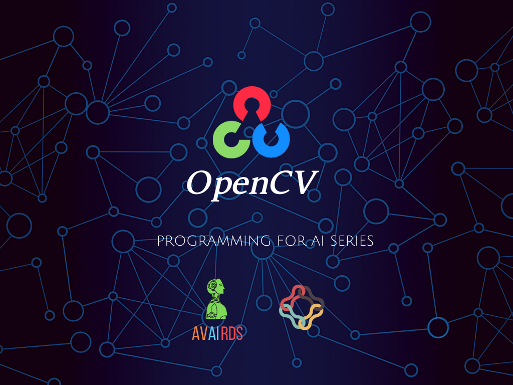

OpenCV with Python 
==========================

OpenCV ဆိုတာ Computer Vision ဆိုင်ရာနည်းပညာများကိုလေ့လာဖို့ အလွယ်တကူယူသုံးနိုင်တဲ့ function တွေကို စုထားတဲ့ open source library တစ်ခုဖြစ်ပါတယ်။ C++, Python, Java စတဲ့ language တွေနဲ့ ရေးလို့ရပါတယ်။ ကျွန်တော်တို့ကတော့ Python နဲ့ပဲ လေ့လာကြမယ်။

👩‍💻💪 ဘာကြောင့်လေ့လာသင့်လဲ။
Computer Vision က AI ရဲ့ အခွဲတစ်ခုဖြစ်ပါတယ်။ ကျွန်တော်တို့ရဲ့ လက်ရှိကိုင်နေတဲ့ Smartphone တွေကို ကြည့်ကြည့်ရင် Facial Recognition, Auto Focus တို့ Facebook tag တို့ Faceapp တို့ကိုကြည့်ပါ။
* 🧐 Computing Devices တွေက ဘယ်လို လုပ်ပြီး မျက်နှာတွေကို ဖတ်တတ်ကြလဲ။
* 🧐 နောက် robot တွေ မှာ object တွေကိုမြင်နိုင်စွမ်း perception, detection တွေကို ဘယ်လိုလုပ်ကြလဲ။
* 🧐 တစ်ချို့ CCTV Camera တွေ လူကို ဘယ်လို trace လိုက်ကြသလဲ။
* 🧐 Photo တွေက နေ data ဘယ်လိုထုတ်ယူသွားလဲ။

စသဖြင့် စိတ်၀င်စားတဲ့သူတွေအတွက် အကျိုးရှိစေမယ့် course ပါ။

လူငယ်တိုင်း ဆွဲခေါ်လာနိုင်ဖို့ ပထမဆုံး ခြေးလှမ်းအနေနဲ့ AVAIRDS နဲ့ Alex Snow School တို ပေါင်းစီပြီး Programing for AI ဆိုတဲ့ Series တွေကို အခုလို့ စတင် မိတ်ဆက်ပေးလိုက်တာ ဖြစ်ပါတယ်။

To install dependencies:

```
python3 -m venv env
. env/bin/activate
pip install -r requirements.txt
```

To run tests:
```
nosetests tests
```
